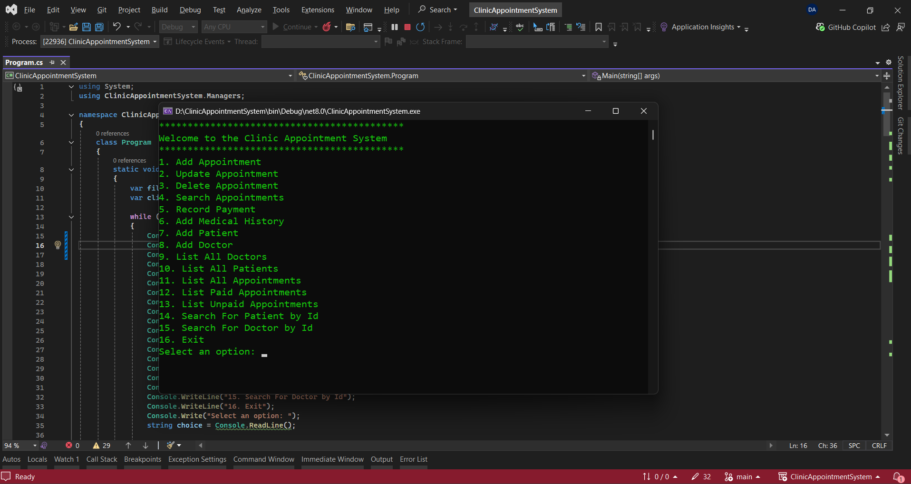

# Clinic-Appointment-System
The Clinic Appointment System is a C# console application designed to streamline clinic operations. It provides a user-friendly interface to manage appointments, add patients and doctors, record payments, and store medical histories. Data is persisted in JSON files for simplicity and portability. Features

